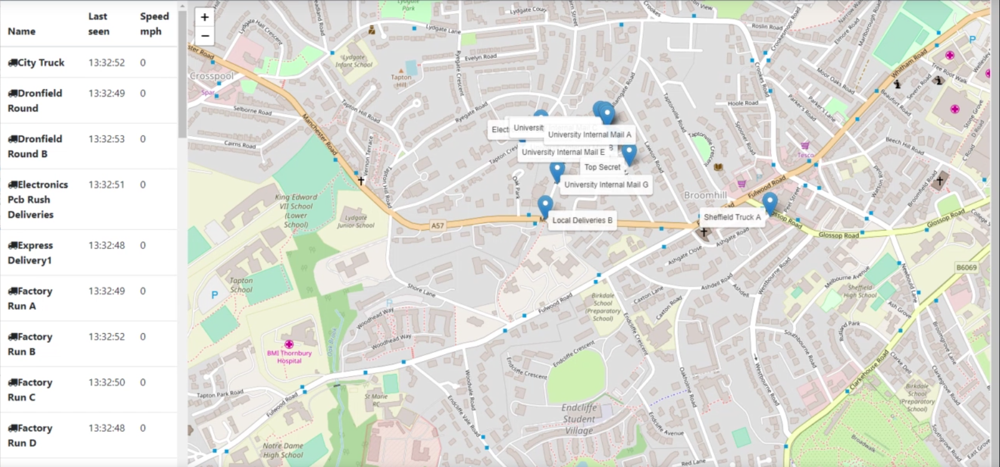

On this project I used Docker and Kubernetes to deploy a fleet management system. The system track each vehicle position in the map and where it's going.

First I started with minikube, locally. After I tested, it was migrated to AWS.

The system architeture:

Running system using AWS
